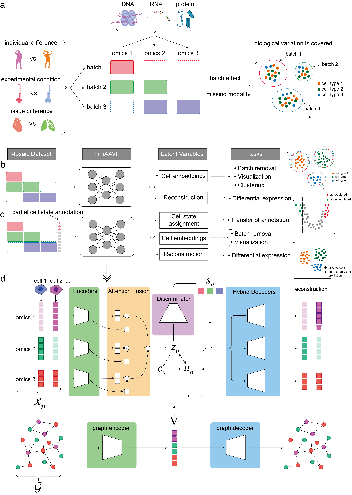

# mmAAVI (Multi-omics Mosaic Auto-scaling Attention Variational Inference)

A deep generative model that addresses mosaic integration challenges.



**Figure 1.** Schematic of mosaic integration and mmAAVI. **a,** Graph illustration of mosaic integration data with 3 batches and 3 modalities. Batch effects may arise from differences in individuals, experimental conditions, or tissue sources. Potential modalities include chromatin accessibility (DNA-level), gene expression (RNA-level), and epitope (protein-level), among others. Due to the combined impact of batch effects and modalities missingness, biological variations (such as cell types) are obscured by systematic errors, making direct integration analysis challenging. **b-c,** The workflow for unsupervised (**b**) and semi-supervised (**c**) analysis using mmAAVI. **d,** Schematic of mmAAVI model. Multi-modal data for each cell $n$ are transformed into embeddings by modality-specific encoders and then fused into a global feature $z_n$, a low-dimensional representation of the cell state following mixture distribution parameterized by discrete $c_n$ and continue $u_n$. A discriminator is used to harmonize the distribution of $z_n$ across different batches $s_n$. Meanwhile, a guidance graph $\mathcal{G}$ with prior knowledge is transformed into feature embeddings $V$ by a graph encoder. Next, modality-specific hybrid decoders map samples from the posterior distribution of $z_n$ and $V$, along with the batch, $s_n$, to parameters of the distribution for each feature of existed modalities. The posterior mean of $z_n$ can be used as input to clustering and visualization algorithms.

## Directory structure

```
.
├── asset                   # Files to shown in readme
├── data                    # Data files with the scripts to download them
├── enviroments             # Scripts and packages lists to create reproducible python and R enviroments
├── experiments             # Codes for experiments and case studies
├── src/mmAAVI              # Main Python codes
├── tests                   # Some test codes
└── readme.md
```

## Installation

1. We suggest creating a separate environment. Below is an example using `mamba` (fast alternative of `conda`):

    ```bash
    mamba create -n mmaavi_env python=3.10 -y
    ```
2. Install `mmAAVI` package from github:

    ```bash
    pip install git+https://github.com/luyiyun/mmAAVI.git@main
    ```

## Usage

Here, we take the PBMC dataset as an example.

1. Prepare the dataset as `MuData` in [mudata package](https://mudata.readthedocs.io/en/latest/).

    ```python
    import mudata as md

    mdata = md.read(osp.join(data_dir, "pbmc.h5mu"))
    print(mdata)
    # MuData object with n_obs × n_vars = 17055 × 9783
    # varp: 'net'
    # 3 modalities
    #     atac:       8366 x 8111
    #     obs:      'cluster', 'coarse_cluster', 'batch'
    #     var:      'chrom', 'chromStart', 'chromEnd'
    #     obsm:     'log1p_norm', 'lsi_pca'
    #     rna:        8689 x 1463
    #     obs:      'cluster', 'coarse_cluster', 'batch'
    #     var:      'chrom', 'chromStart', 'chromEnd', 'strand'
    #     obsm:     'log1p_norm', 'lsi_pca'
    #     protein:    17055 x 209
    #     obs:      'cluster', 'coarse_cluster', 'batch'
    #     var:      'alias'
    #     obsm:     'log1p_norm', 'lsi_pca'
    ```

2. Train mmAAVi model with the dataset.

    ```python

    model = MMAAVI(
        input_key="log1p_norm",   # the key of mudata.mod[xxx].obsm which will be fed into model
        output_key=None,          # the key of mudata.mod[xxx].obsm which will be reconstracted, None means mudata.mod[xxx].X
        batch_key="batch",        # the key of mudata.obs[xxx] which will be considered as batch indices
        # sslabel_key="sslabel",  # the key of mudata.obs[xxx] which will be considered as semi-supervised label, np.NaN or NA will be considered as unlabeled.
        net_key="net",            # the key of mudata.varp[xxx] which will be considered as guidance graph
        num_workers=4,
    )
    model.fit(mdata)
    ```
    After training is complete, the results will be stored in MuData:
    ```python
    print(mdata)
    # MuData object with n_obs × n_vars = 17055 × 9783
    #     obs:  'coarse_cluster', 'batch', 'semisup_label', 'batch__code'
    #     obsm: 'mmAAVI_z', 'mmAAVI_att', 'mmAAVI_c'
    #     varm: 'mmAAVI_v', 'mmAAVI_v_std'
    #     varp: 'net'
    #     3 modalities
    #         atac:       8366 x 8111
    #         obs:      'cluster', 'coarse_cluster', 'batch'
    #         var:      'chrom', 'chromStart', 'chromEnd'
    #         obsm:     'log1p_norm', 'lsi_pca'
    #         rna:        8689 x 1463
    #         obs:      'cluster', 'coarse_cluster', 'batch'
    #         var:      'chrom', 'chromStart', 'chromEnd', 'strand'
    #         obsm:     'log1p_norm', 'lsi_pca'
    #         protein:    17055 x 209
    #         obs:      'cluster', 'coarse_cluster', 'batch'
    #         var:      'alias'
    #         obsm:     'log1p_norm', 'lsi_pca'
    ```

3. You can use the Leiden clustering method to cluster based on the learned features.

    ```python
    sc.pp.neighbors(mdata, use_rep="mmAAVI_z")
    sc.tl.leiden(mdata, resolution=0.1, key_added="leiden")
    ```

4. Use Bayes Factor to filter highly expressed features in each cluster.

    ```python
    model.differential(mdata, "leiden")
    ```

## Reproduce results in paper

> The code of PBMC and MOP5B has been completed.

1. clone the repository.

    ```bash
    git clone https://github.com/luyiyun/mmAAVI.git
    ```

2. Building the enviroment.

    ```bash
    cd ./mmAAVI/experiments
    pip install -r requirements.txt
    ```

3. Run the scipts in `experiments` to download and analysis the benchmark datasets.

    ```bash
    bash 0_download.sh
    python 1_preprocess.py
    python 2_mmAAVI.py
    ```
